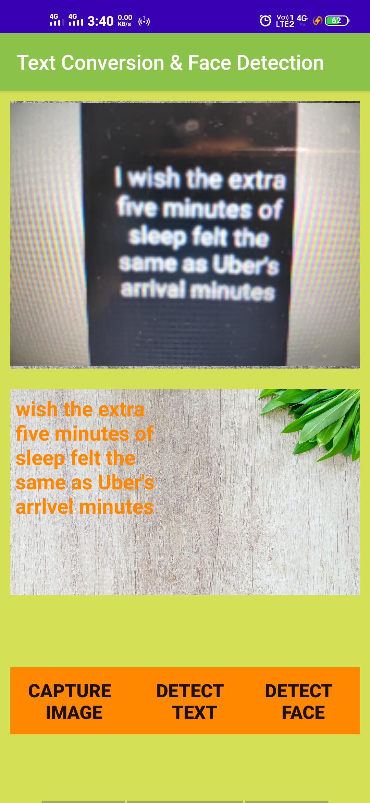
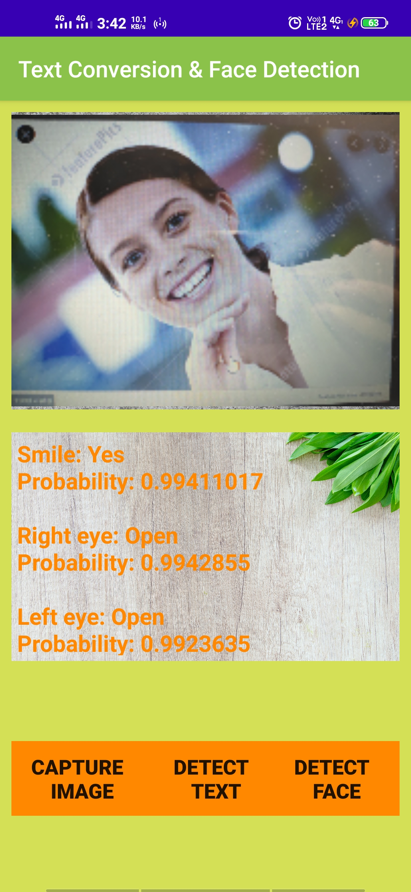

# Text-Conversion-And-Face-Detection
Welcome :smile: To Recognision of Text from image and face detection  generating application " Text-Conversion-And-Face-Detection"

## All about  Text-Conversion-And-Face-Detection Application
- Recognision of Text from image is shown.
- Capture button captures any image by accessing your camera.
- It works on a Manchine Learning Kit that is provided by Firebase.
- If you donot know the code you can use ML-kit to make this kind of project.
- Users can capture the image and can get all the text written on it on the display.
- The text appeared in the display can easily be copy pasted when needed to another place.
- Users can capture the image of face and it will describe about the properties of face with the help of ML. 

## APPLICATION DISPLAY
<abc></abc>
<abc></abc>


## Getting Started

These instructions will get you a copy of the project up and running on your local machine for development and testing purposes. See deployment for notes on how to deploy the project on a live system.

### Prerequisites

What things you need to install the software and how to install them

```
1. Android Mobile
2. Android Studio
3. Knowledge of Java And Firebase
That's it!
```

### Installing

A step by step series of examples that tell you how to get a development env running :exclamation:

Say what the step will be

```
You can Download the project using below link-
https://github.com/Ashish-sah/Text-Conversion-And-Face-Detection
```
## Built With Love
* Android Studio
* Java

## Contributing

All contributions  are welcomed .

## Author
* **Ashish Sah** - https://www.linkedin.com/in/ashish-sah-943171160/
